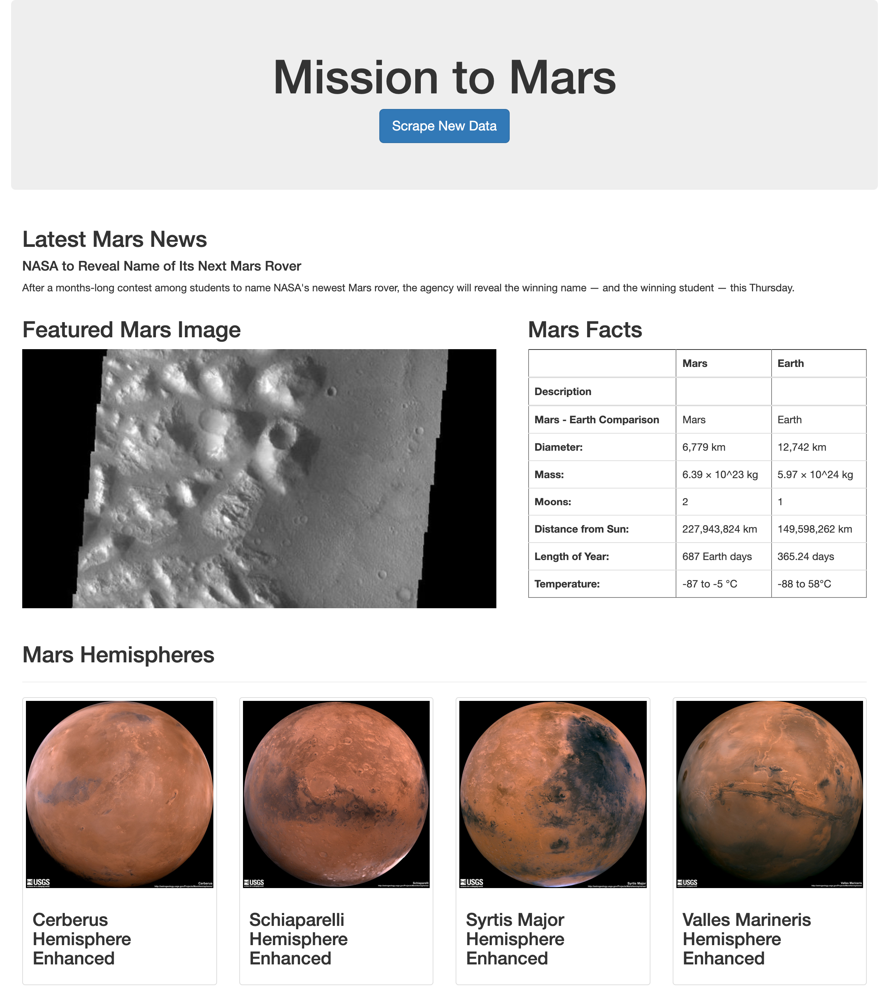

# Web Scraping Challenge
For this challenge we are tasked to create an html page that will present the latest information from various websites that contain mars planetary information. In order to put together this web page we will build an application that will scrape the different web sources that will help display the data on our html page. 

### Scraping Websites

For this process I began by using Jupyter Notebook to test the logic behind scraping three different websites. Most of the scrapping was done using beautiful soup and splinter to access the different sources that would be added to the html. Overall, there were four sections that needed to be added to the html to complete the scraping.

- For the first section, I scraped [redplanetscience.com](https://redplanetscience.com/) to get a title of the latest news and a paragraph.
- For the second section, the featured image needed to be scrapped from [spaceimages-mars.com](https://spaceimages-mars.com/). This involved more of a process than the first section because the image link needed to be pulled from the lightbox that it was contained in. 
- For the third section, I needed to obtain facts about Mars in a table and to do that I scraped [galaxyfacts-mars.com](https://galaxyfacts-mars.com/) and retrieved the data from the Mars Diagrams section. After obtaining the data, I adjusted the table by converting it to a data frame using pandas, then changed the table to html, and from there stored the html code to a string that I would use later in my html index file.
- The final thing that needed to be scraped was the mars hemispheres content from [marshemispheres.com](https://marshemispheres.com/). This portion took more time and was more involved. The content was scraped in a way that it would visit each hemisphere page, store the image url of the full resolution image and retrieve the hemisphere title. After all content was been gathered, it was then saved as a list of dictionaries stored in a variable. 

### Preparing the Python Scrape File

After all logic has been tested in Jupyter Notebook, the content is then transferred over to a python srape file. Only the important craping code is used and any extra code that is not needed is left out to avoid any issues. This python file will have all the scrape code and will then gather all variables to store them in a dictionary so that it can then be accessed in the html index file. But before getting to the html file I needed to set up the app file.

### Setting Up the App File

Once my scrape file was completed, I then moved on to set up the app python file. For this file I made the connection to the mongo database and made the proper connections to the scrape file and also a connection to the index html file. After completing the set up and made sure all names were properly  used and assigned I then moved to the html file.

### The HTML File

Setting up this file was straight forward since it only required the use of stored variables instead of writing out the content. These variables were added to specific divs and tags that used classes from bootstrap.  Using bootstrap was very useful in organizing the content in a clean and responsive manner. 

### Aftermath

After all files were completed, the app was then activated using terminal to launch the web browser. I had a couple of issues initially but after addressing the errors the app was able to function correctly and scrape all content that was gathered. 

